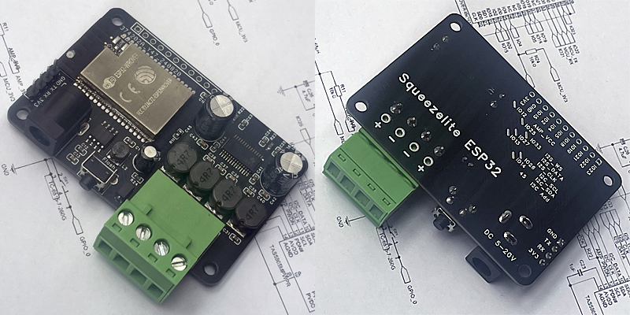

# SmartAmplifier-ESP32 (SmartAmp)
 High-Fidelity Class-D Smart Audio Amplifier

### Product Overview
 SmartAmp is a compact intelligent audio amplifier powered by the ESP32-WROVER chipset, featuring built-in PSRAM. Its power amplification is driven by the TAS5805M module, delivering the following output capabilities:
#### 12V input: 2x4Ω / 15W
#### 22V input: 2x8Ω / 23W
The combination of high power output and ample PSRAM enables it to effortlessly drive full-sized speakers and efficiently handle audio applications. SmartAmplifier-ESP32 supports various firmware installations (e.g., Squeezelite, YoRadio, ESPHome), offering exceptional performance and versatility. In standby mode, its average power consumption is below 1W, showcasing excellent energy efficiency.

### Where to get:
#### [https://www.tindie.com/stores/cxandy/]

### Core Features and Firmware Support
#### 1.ESPHome 
 Integrates an external I2S DAC for high-quality, hi-fi audio playback.
 Seamlessly integrates with Home Assistant for smart home control.
 Combines high power output and memory capacity to handle complex audio streaming effortlessly.
 
#### 2.Squeezelite-ESP32 
 Originally designed as a multimedia player for Logitech Media Server (LMS).
 Supports Spotify wireless playback via SpotifyConnect.
 Compatible with AirPlay (for iPhone, iTunes, etc.), including multi-room synchronization (AirPlay 1 only).
 Supports traditional Bluetooth connectivity, compatible with iPhone and Android devices 
 Can be flashed directly via a browser using the Squeezelite-ESP32 installer.
 [https://sle118.github.io/squeezelite-esp32-installer/]
#### For details, please click [[How to install Squeezelite](Squeezelite/)]

####   
#### 3.yoRadio
 Web-radio based on ESP32-audioI2S library
##### [https://github.com/e2002/yoradio] See wiki[https://github.com/e2002/yoradio/wiki] for details

### Hardware Specifications
 Main Chip: ESP32-WROVER (with 4MB PSRAM)
 Power Amplifier: TAS5805
 
### Pin Definitions:
#### Function	     |     ESP32 Pin
##### I2S CLK     	|     GPIO13
##### I2S DATA	    |     GPIO27
##### I2S WS	      |     GPIO33
##### TAS5805 SDA	 |     GPIO14
##### TAS5805 SCL	 |     GPIO26
##### TAS5805 PWDN	|     GPIO12
##### TAS5805 I2C ADDR | 0x2D

### Power Interface
 DC 6mm barrel/2mm pin (commonly 5.5/2.5mm plug)
### Power Requirements
 Select an adapter based on speaker power and impedance. For example, calculate voltage and current for driving 2x10W/8Ω speakers.

### Usage Notes
 Power Connection: Do not connect Vin and USB simultaneously, as this may damage the USB port.
 Audio Streaming Buffer: Ensure proper buffer settings for stable playback.

### Application Scenarios
 SmartAmp combines the robust computational power of the ESP32 with a high-fidelity Class-D amplifier, making it ideal for developing premium audio products and smart home integration projects. Whether for audio enthusiasts or developers, SmartAmp stands out as an excellent choice due to its powerful hardware and flexible software support.
