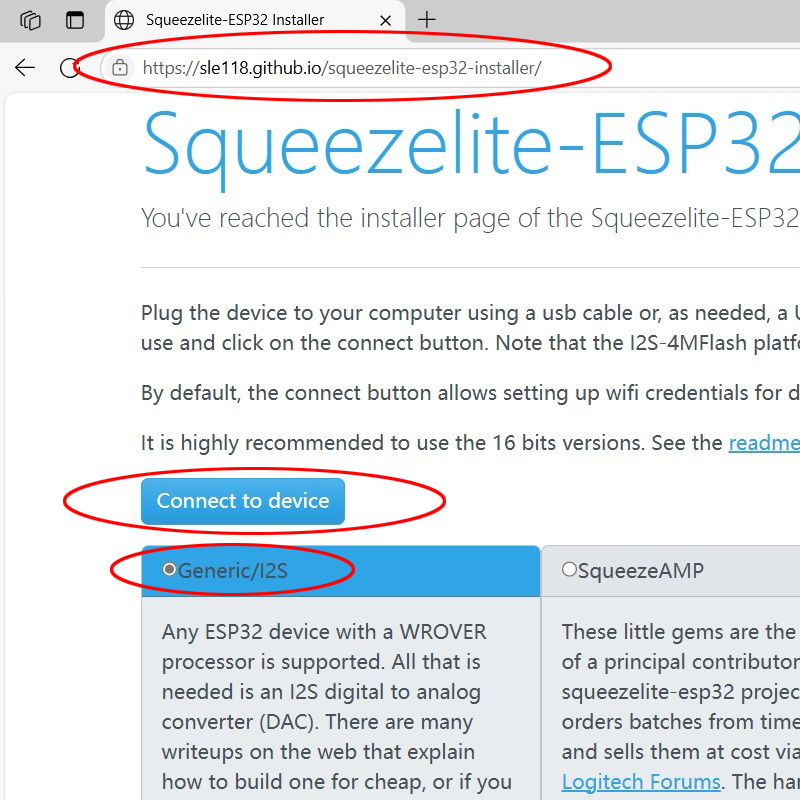
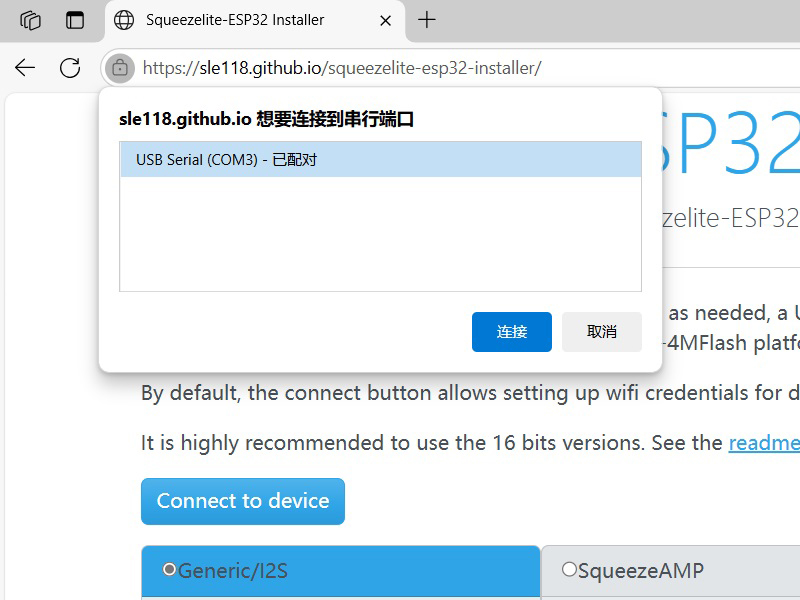
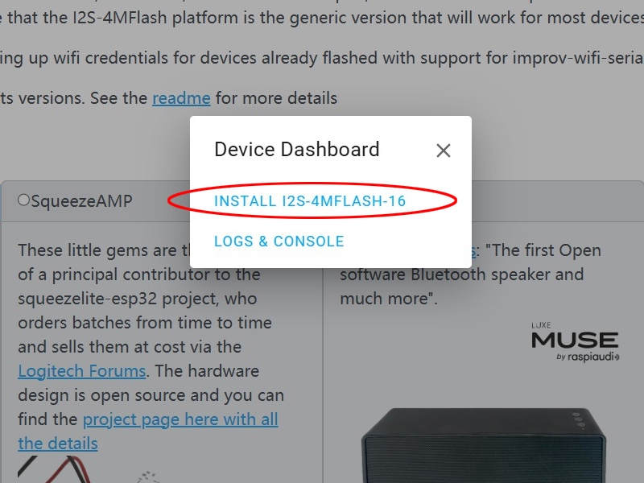
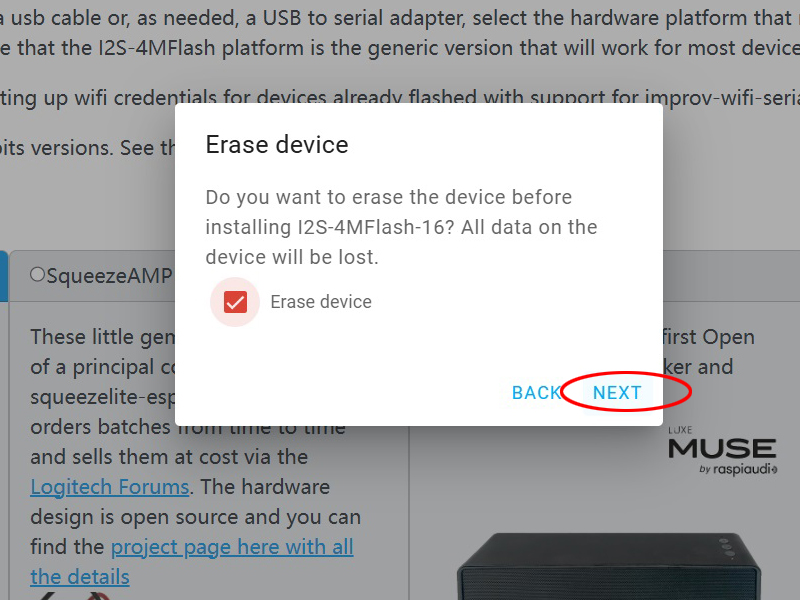
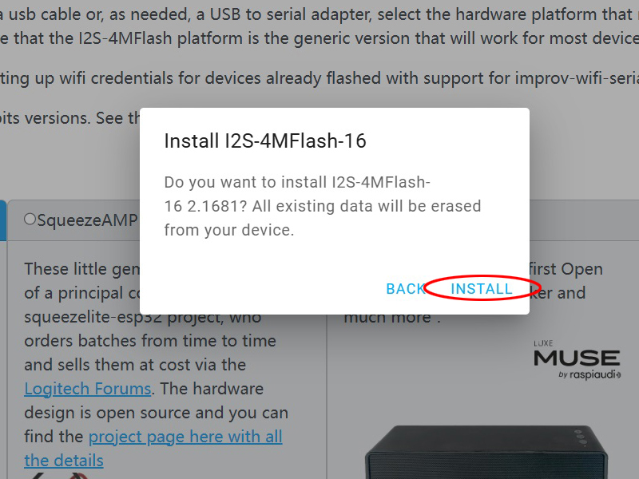
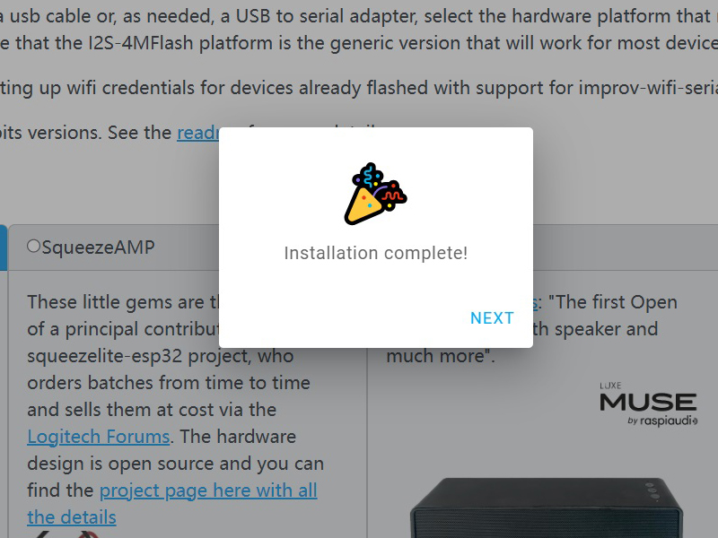
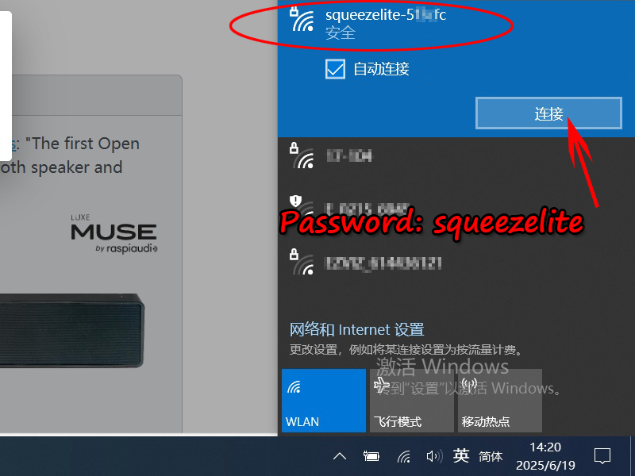
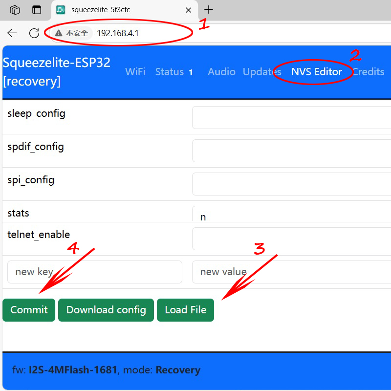
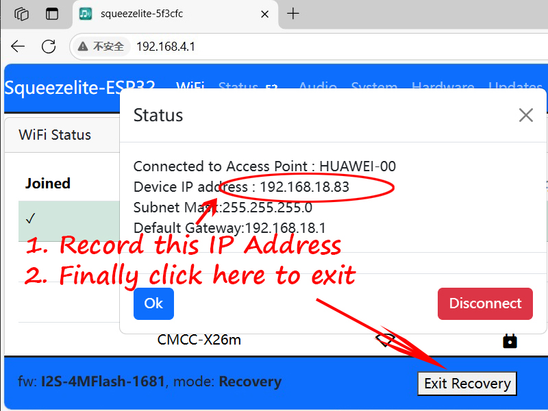
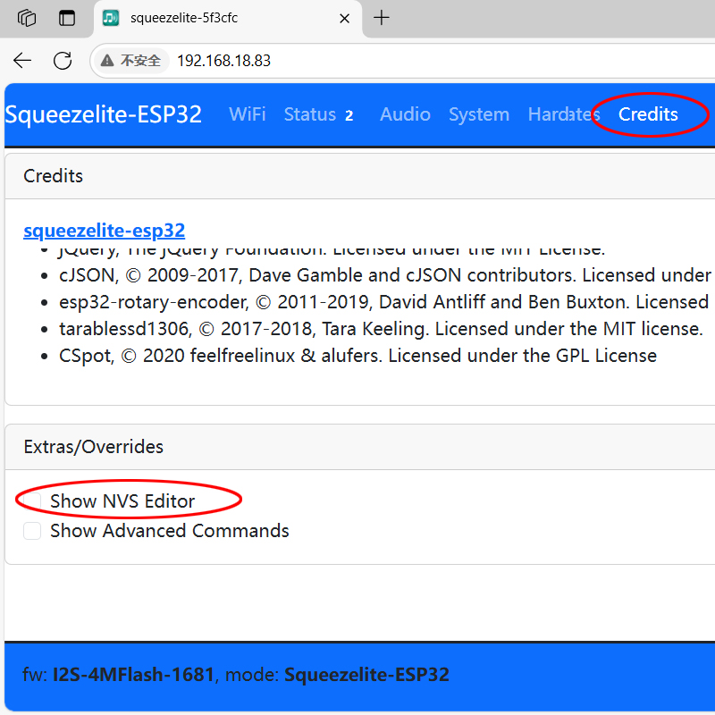

## How Install Squeezelite
### 1. Flash Squeezelite-ESP32 Firmware

#### Next step

#### Next step

#### Next step

#### Next step

#### Complete

###
### 2. Config Squeezelite-ESP32 Firmware
###  == Remove usb, Only Insert DC.

#### Download config File:[[nvs_config_squeezelite_json.txt](nvs_config_squeezelite_json.txt)] 
#### upload 

#### Setup WIFI 

#### Last Step

### If the menu item NVSEDIT cann't be found

